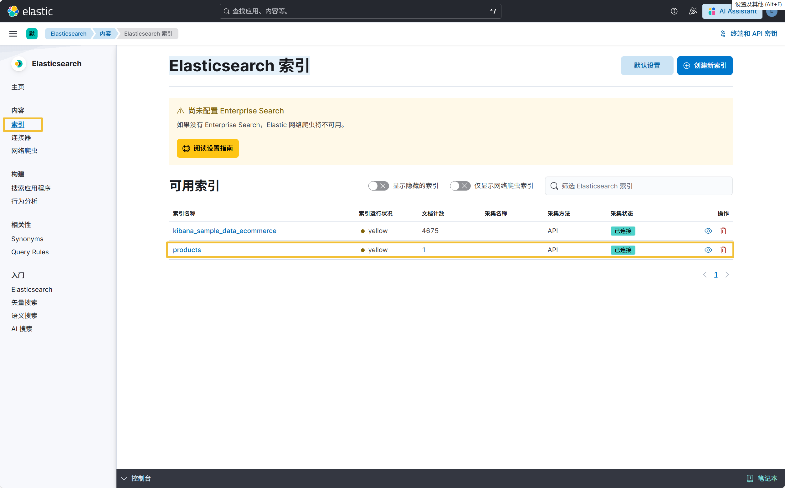

# Spring Boot整合Elasticsearch实现增删改查

## 项目简介

这个项目演示了如何使用Spring Boot3.5.4和Elasticsearch8.19.0构建一个简单的产品管理系统，涵盖了Elasticsearch的基本操作，包括创建、读取、更新和删除（CRUD）操作。

## 项目目录

```  tree
es-study/
├── src/
│   ├── main/
│   │   ├── java/
│   │   │   └── org/fct/es/
│   │   │       ├── entity/
│   │   │       │   ├── Product.java
│   │   │       │   └── ProductRepository.java
│   │   │       ├── service/
│   │   │       │   └── ProductService.java
│   │   │       └── EsStudyApplication.java
│   │   └── resources/
│   │       └── application.yml
│   └── test/
│       └── test/java/org/fct/es/EsStudyApplicationTests.java
└── pom.xml
```

各目录及文件作用说明

1. src/main/java: 存放Java源代码
    - org.fct.es.entity: 实体类和数据访问接口
        - Product 实体类：定义产品的数据结构
        - ProductRepository 接口：定义数据访问方法
    - org.fct.es.service: 业务逻辑层
        - ProductService 类：实现产品的增删改查等操作
    - EsStudyApplication.java: Spring Boot启动类
2. src/main/resources: 配置文件目录
   application.yml: 应用配置文件，配置Elasticsearch连接信息
3. pom.xml: Maven项目配置文件，定义项目依赖和构建配置

## 部署步骤

### 启动Elasticsearch

1. 前提，已经安装了Docker和Docker Compose
    ```shell
    docker 24.0.5
    docker-compose v2.6.1
    ```
2. 安装Elasticsearch
   ```shell
   # 准备一个干净的目录
   mkdir elasticsearch-kibana
   cd elasticsearch-kibana
   # 将项目中doc/script/docker文件夹下的内容复制到当前目录
   cd elasticsearch/scripts
   # 把init.sh改成可执行文件并 执行
   chmod +x init.sh
   ./init.sh
   cd ..
   docker-compose up -d
   # 查看是否启动成功
   docker ps
   # 出现一下内容不报错，说明es部署成功了
   d57f2a3e74dd   elasticsearch:8.19.0
   ```
3. 访问Elasticsearch，访问 http://ip:9200，输入账号密码elastic/Elastic_Kiz5eX，输出以下信息说明成功
   ```json
   {
   "name" : "d57f2a3e74dd",
   "cluster_name" : "docker-cluster",
   "cluster_uuid" : "6HxwZLSdSdiwFA3lXGsaMQ",
   "version" : {
   "number" : "8.19.0",
   "build_flavor" : "default",
   "build_type" : "docker",
   "build_hash" : "93788a8c2882eb5b606510680fac214cff1c7a22",
   "build_date" : "2025-07-23T22:10:18.138212839Z",
   "build_snapshot" : false,
   "lucene_version" : "9.12.2",
   "minimum_wire_compatibility_version" : "7.17.0",
   "minimum_index_compatibility_version" : "7.0.0"
   },
   "tagline" : "You Know, for Search"
   }
   ```

### 启动Kibana

1. 安装Kibana
   ```shell
   # 修改doc/script/docker/kibana/docker-compose.yml和doc/script/docker/kibana/data/conf/kibana.yml中的两个ip地址成自己的
   # 继续看doc/script/docker/kibana/scripts/init.md
   ```
2. 访问Kibana，访问 http://ip:5601，输入账号密码elastic/Elastic_Kiz5eX，输出以下信息说明成功
   

### 启动项目

1. 执行src/test/java/org/fct/es/EsStudyApplicationTests.java中testSave方法，kibana中可以看到数据
   
2. 可继续执行其他方法，查看数据是否正确
    - contextLoads 测试查询所有数据
    - testSaveOne 测试保存一条数据
    - testSaveAll 测试保存多条数据
    - testFindByName 测试根据名称查询数据
    - testFindByDescriptionContaining 测试根据描述查询数据
    - testFindByCategoryAndPriceRange 测试根据分类和价格范围查询数据
    - testDeleteAll testFindById 测试根据id查询数据
    - testUpdateNameById 修改名称

### 安装ik分词器
ik分词器下载地址：https://release.infinilabs.com/analysis-ik/stable/
```shell
docker exec -it elasticsearch-saRr /bin/bash
bin/elasticsearch-plugin install https://get.infini.cloud/elasticsearch/analysis-ik/8.19.0
exit
docker restart elasticsearch-saRr
```